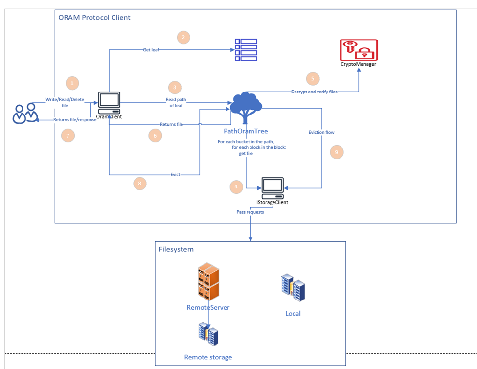
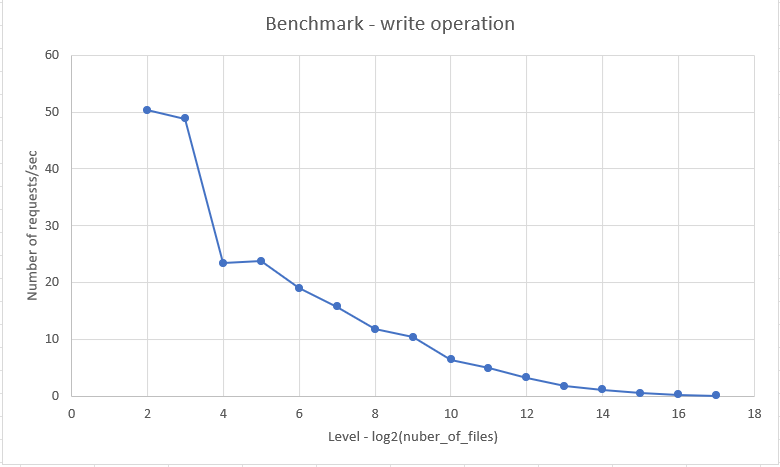
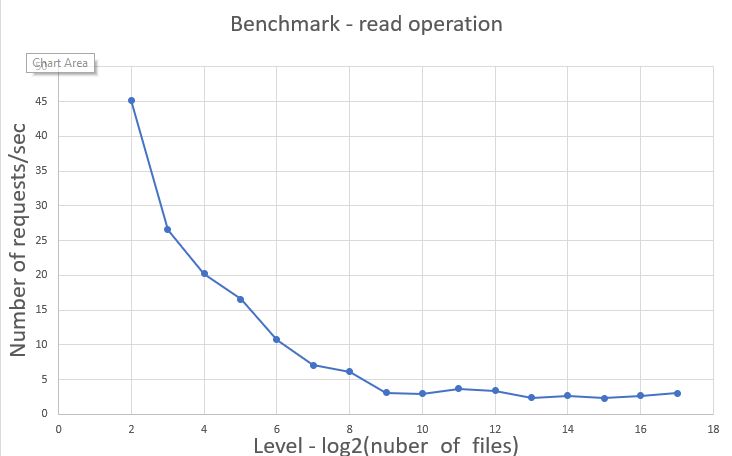

# Path Oram protocol:

This is an implementation of the path - [oram protocol](https://eprint.iacr.org/2013/280.pdf)

# Solution overview:

The goal of ORAM is to completely hide the data access pattern (which blocks were read/written) from the server.
I implemented path ORAM protocol based on the algorithm that was introduced
in `Path ORAM: An Extremely Simple Oblivious RAM Protocol` (link).
In short, the client needs to save files in remote storage and hide the access patterns from the server.
The client support 3 API’s:

- Write(filename : string)
- Read(filename : string, content : bytes)
- Delete(filename:  string)

I decided to modify the algorithm and keep all the logic on the client end - the reason is that when you keep the logic
on the client side then you can use any filesystem that you want regardless of the owner of the storage (for example, I
created one local fs client and one remote fs client that connect against my server– it is very easy to enhance the
client interface and s3 client).
Each file is encrypted and signed by the client before it is stored in the storage.
When you initialize the OramClient you need to pass few argumetns:

- Number of files to support – multiplication of 2
- File size (all files in ORAM protocol should be in the same size)
- Storage client – storage client interface that supports the methods that were mentioned above– default is
  RemoteFsClient that works against server

## Design



## Technologies and Frameworks:

- Program language: python 3.10
- Crypto framework:
- Encryption: AES - cryptography.hazmat.primitives.ciphers
- Message authentication - hmac
- Server framework: http.server
- Client framework:  requests
- Tests framework: unittest
- Profile program framework – cProfile – used in order to investigate bottlenecks

## Performance

- Write operation:



- Read operation:



## Usage:

### Local filesystem

```python
    # Setup client
from src.oram.OramClient import OramClient
from src.storage.LocalFsClient import LocalFsClient

oram_manager: OramClient = OramClient(number_of_files=2048, file_size=512, storage_client=LocalFsClient())
oram_manager.write("myfile", b"this is the content of the file")
oram_manager.read("myfile")
```

### Remote filesystem

```python
    # Setup client
from src.oram.OramClient import OramClient
from src.storage.RemoteFsClient import RemoteFsClient

oram_manager: OramClient = OramClient(number_of_files=2048, file_size=512,
                                      storage_client=RemoteFsClient(host="localhost", port=8080))
oram_manager.write("myfile", b"this is the content of the file")
oram_manager.read("myfile")


```

### Setup server

```python
    # Setup client
from src.server.OramHTTPRequestHandler import OramHTTPRequestHandler

if __name__ == '__main__':
    OramHTTPRequestHandler.run(address="localhost", port=8080)
```